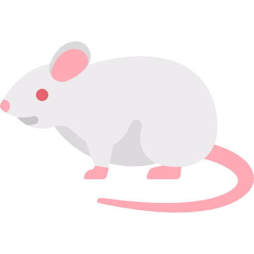

# Nezumi

This is a simple focus-follows-mouse application. This offers a tray icon that can be used to autostart the application.

## TODO:
- [ ] Add config file parsing
- [ ] Add logging

> [!NOTE]
> Thanks to [Jeezy](https://github.com/LGUG2Z/masir) for some pointers and ideas.

> [!IMPORTANT]
> [Rodent icons created by Freepik - Flaticon](https://www.flaticon.com/free-icons/rodent)